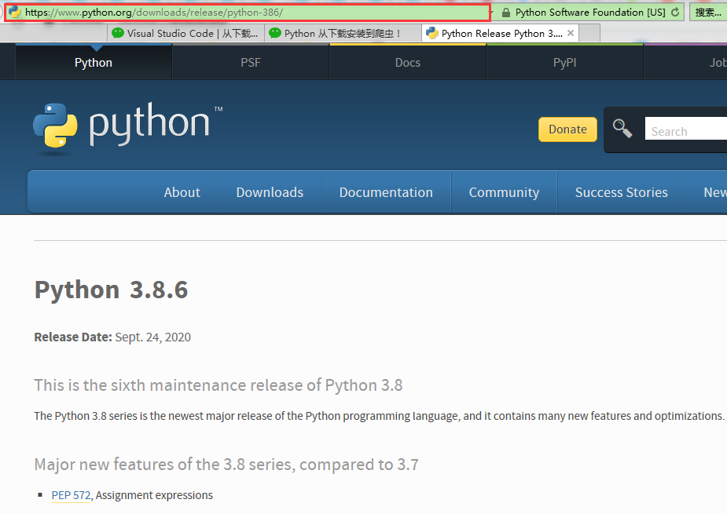
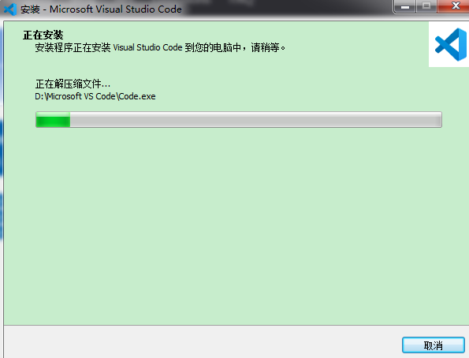
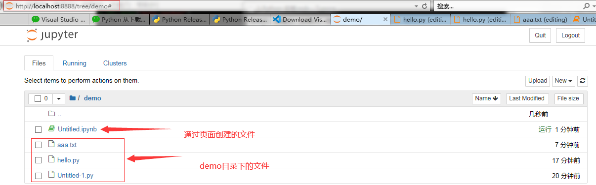

# Jupyter-notebook安装文档v1.0

​																																	*李明理  2020 年 10 月 16 日*


[TOC]


## 1. 环境说明

工欲善其事必先利其器。学习高大的AI大法，安好工具、熟悉常用技能很有必要的

##### 1.1 电脑环境：
64位win7 + intel i5 + 8G RAM 

##### 1.2 相关软件版本

python 3.8.6 amd64

visual studio code x64 1.49.3

jupyter-notebook 6.1.4

以上软件均为当前（截至2020年10月6日）最新版本，python 与vscode安装包也可以在下面链接下载

链接：https://pan.baidu.com/s/1O46nueaSsdaNFiMWt5V8Ng 
提取码：smqb

jupyter-notebook 直接通过命令行安装，不需要安装包

**小技巧**：1.[哔哩哔哩](http://www.bilibli.com)上有许多软件安装以及学习较详细的视频，值得学习

​                2.机器学习安装软件也可以通过anaconda安装(详情可以见上一条！！！)

## 2. Python 下载与安装

Python 2.7的终止日期最初定为2015年，由于担心大量现有代码无法轻易地移植到Python 3而推迟到2020年，Python3.X在库的名称上也有所改变，所以建议安装Python3.X版本。

##### 2.1 官网下载

[python官网地址](https://www.python.org/downloads/windows/)

打开上面官网链接地址，找到目前最新stable版本，点击红色箭头链接


进入下图所示网页



滑动滚动条，找到如下图箭头所示，点击即可下载


##### 2.2 python本地安装

直接双击安装包以管理员身份运行（注意勾选图中箭头所示选项！！！）


安装完成后，打开cmd命令窗口，输入python,出现下图所示内容即安装python成功！


## 3. 配置python pip国内源

新建 pip 配置文件夹，直接在user用户目录中创建一个名为 pip 的文件夹( 即%HOMEPATH%\pip)，如下图所示：


接着在 pip 文件夹中创建一个名为 pip 的文本文件(后缀名由" .txt "改为 " .ini ")，格式如上图所示：

 文件内容如下：

```
[global]
index-url = https://pypi.tuna.tsinghua.edu.cn/simple
[install]
trusted-host = https://pypi.tuna.tsinghua.edu.cn
```

修改完成后**保存**，启动 cmd，使用 " pip install xxx "(xxx为你要下载的包名，比如 pip install numpy)，即可默认使用国内源下载。

## 4. Visual Studio Code(VS Code)下载与安装

##### 4.1 官网下载

[VS code官方网址](https://code.visualstudio.com/Download)

选择**System Installer**版本双击下载即可，如下图所示


##### 4.2 VS Code 安装 

安装包下载后右键以管理员身份运行

勾选同意，点击下一步


修改或默认安装目录，点击下一步


一直点击下一步，直到完成安装就行




## 5.VS Code 简单配置与使用

首先打开VSCode软件，可以看到刚刚安装的VSCode软件默认使用的是英文语言环境，如下图：


这里需要使用快捷键【Ctrl+Shift+P】来实现，如下图：

在弹出的搜索框中输入【configure language】，然后选择搜索出来的【Configure Display Language】,如下图：


点击后，可以看到旁边**EXTENSIONS: MARKETPLACE** 中有多种语言可以选择，你只要选择中文，进行安装，然后安装完成会重启软件，然后打开就是中文的了。


同样地，在扩展商店EXTENSIONS: MARKETPLACE(扩展：商店)中安装python插件，如下图所示，重启VS code


使用快捷键【Ctrl+N】新建文件，并保存为hello.py(后缀名不能省)

输入

```
print("python")
```

快捷键【Ctrl+S】保存即可，打开终端（如下图所示），点击Run按钮，可看到终端输出内容。


## 6. Jupyter-notebook 安装

在上图demo目录（目录下有hello.py Untitled-1.py 等文件）下打开cmd，命令行输入

**pip install jupyter** 即可安装jupyter-notebook

cmd 命令行输入**jupyter --version**即可查看jupyter-notebook版本

安装完成后，直接在命令行输入**jupyter notebook**即可启动

笔记本默认浏览器就会自动打开页面



## 7. Jupyter-notebook 简单使用

如下图所示，点击new, 选择python3,就会创建文件Untitled.ipynb，并且打开一个页面，在页面中即可编辑代码，并且实时运行


魔法命令 %run           **注意hello.py文件的相对目录，这里通过%run 调用hello.py中的函数**


hello.py 的代码如下图所示


部分用户可能需要用到模块（模块代码可以在链接：https://pan.baidu.com/s/1O46nueaSsdaNFiMWt5V8Ng 
提取码：smqb  下载），也会上传到码云上


                          ## 8.VS Code中使用Jupyter Notebook

在扩展商店中安装官方的Python扩展包   


在VS Code中创建创建一个.ipynb的文件

Ctrl+Shift+P输入 Create Jupyter，然后创建即可

​                   

然后就进到Jupyter中了

​            

​                                                                 


后面的使用方法就跟网页中的操作差不多了，编辑代码后**注意保存**

